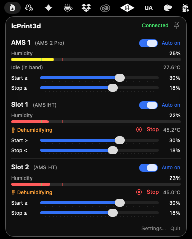

# BambuDry

> A small utility that automatically dehumidifies your Bambu printer's AMS
> units using the built-in heater, controlled over LAN. Free and open source.

<p align="center">
  
</p>

When humidity creeps up, the heater turns on. When humidity drops back to your
target, the heater turns off. Anti-cycling guards prevent rapid toggling.
That's it.

## Status

| Platform | Status | Download |
|----------|--------|----------|
| **macOS** (13 Ventura+) | Working | [Latest .dmg](https://github.com/lcCode-dev/BambuDry/releases) |
| **Windows** (10 1809+ / 11) | Working | [Latest .exe installer](https://github.com/lcCode-dev/BambuDry/releases) |

The macOS version is a SwiftUI menu bar app. The Windows version is an
Avalonia 11 / .NET 8 port that mirrors the macOS feature set: tray icon
with a borderless dropdown, per-AMS humidity bars / Auto toggles /
threshold sliders / manual Stop, tabbed Settings (Printer / Defaults /
Advanced) with launch-at-login, dry-run, and a recent-publishes log.

Both implementations share the wire format documented in
[docs/PROTOCOL.md](docs/PROTOCOL.md). The pure-logic hysteresis controller
+ MQTT message types are implemented in Swift on macOS
(`macos/Sources/BambuDryCore/`) and in C# on Windows
(`windows/src/BambuDry.Core/`), with mirrored test suites on each side.

## Why it exists

Bambu's AMS HT and AMS 2 Pro have built-in heaters that can keep filament
spools dry. The official software supports manual drying for hours at a time
(rescue-wet-spool mode), but doesn't continuously maintain low humidity.
BambuDry is the missing piece: humidity-threshold-driven, set-and-forget,
gentle and brief instead of long and hot.

## Requirements

- A Bambu printer with at least one AMS 2 Pro or AMS HT
- **Developer Mode enabled on the printer** (Settings → General → Developer Mode).
  Without this the firmware silently rejects remote commands. See
  [docs/DEVELOPER_MODE.md](docs/DEVELOPER_MODE.md).
- The printer's LAN access code (Settings → WLAN on the touchscreen)

## Repository layout

```
bambudry/
├── docs/                     ← shared protocol documentation, screenshots
├── macos/                    ← SwiftUI menu bar app
└── windows/                  ← Avalonia 11 / .NET 8 desktop app
```

Both apps share the wire format documented in
[docs/PROTOCOL.md](docs/PROTOCOL.md). The pure-logic hysteresis + MQTT
message types are mirrored in Swift (`macos/Sources/BambuDryCore/`) and
C# (`windows/src/BambuDry.Core/`), each with their own test suite that
validates the same `ams_report.json` fixture verbatim.

## Tip jar

If BambuDry saves you a wet-filament print, you can buy me a coffee:

- ☕ [Buy Me a Coffee](https://www.buymeacoffee.com/lccode) (link to be added)
- 💖 [GitHub Sponsors](https://github.com/sponsors/lcCode-dev) (pending org verification)

Tips are appreciated but never required. The app is and will remain free.

## Contributing / issues

Issues and PRs welcome. Two things to keep in mind:

1. **Don't paste your printer's serial or access code** in issue text or logs.
   Both can be used to control your printer over LAN.
2. **Test fixtures should be sanitized** — see `macos/Tests/.../Fixtures/ams_report.json`
   for an example with placeholder values.

## License

[MIT](LICENSE) — do whatever you want with the code, no warranty.

BambuDry is not affiliated with or endorsed by Bambu Lab. "Bambu Lab" and
"AMS" are trademarks of Bambu Lab Co. Used here under nominative fair use to
describe what hardware this software works with.
